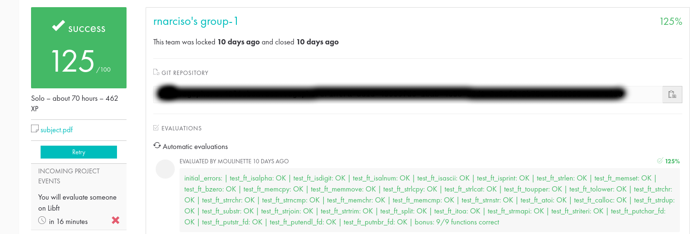

# Libft-Project
Greetings!
This is the first 42 School Project where I had to create my own library in C from scratch, according to the rules mentioned in the subject.

This is the subject: [Libft Library](https://github.com/merlin-101/Libft-Project/blob/main/en.subject.pdf)

The final evaluation: 

